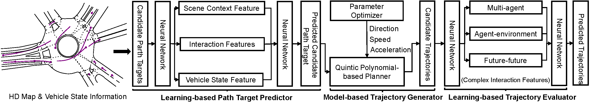
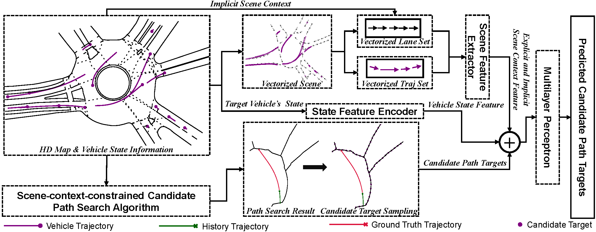
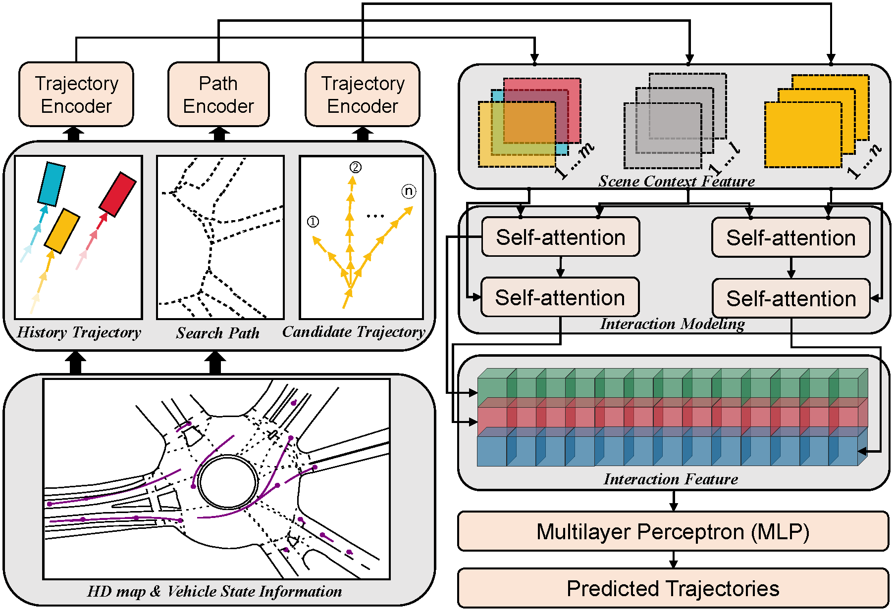
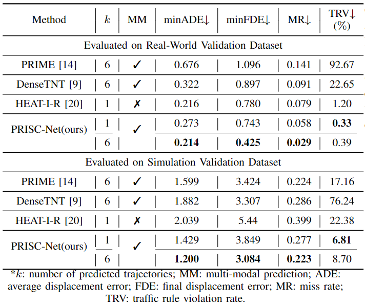

# ISC-PRIME-V1

## Introduction
We make accurate prediction of vehicle future motion by combining model- and learning-based methods, named PRISC-Net.

## Framework of Method
The framework of PRISC-Net is as below:

The framework of Learning-based Path Target Predictor is as below:

The framework of Learning-based Trajectory Evaluator is as below:

## Experiment
### Evaluation Metric

- **minimum Average displacement Error** (minADE): the $l_2$ distance between the most possible trajectory among $k$ predicted trajectories and the ground-truth, averaged over all future time steps ($k=6$ in this paper).
- **minimum Final Displacement Error** (minFDE):  the $l_2$ distance between the most possible trajectory among $k$ trajectories and the ground-truth at the final time step of prediction.
- **Miss Rate** (MR): the ratio of cases where the displacement between the predicted endpoint and the ground-truth endpoint exceeds the pre-defined threshold $\beta$ ($\beta=2.0 m$ in this paper). 
- **Traffic Rule Violation Rate** (TRV): the ratio of scenarios where any predicted trajectory violates traffic rule or scene context constraints. Typical cases include entering non-reachable area, speeding and retrograding. 
  - **Entering non-reachable area** is the case that any point of any predicted trajectory lies in the non-reachable area. 
  - **Speeding** means that the speed of any point in any predicted trajectory is exceeds the speed limit. 
  - **Retrograding** means the angle between the driving direction of any point of any predicted trajectory and the lane exceeds $\frac{\pi}{2}$.

### Implementation Details

All models are trained on a NVIDIA TITAN V100 GPU with $12$ GB memory, and the implementation details for each stage are as follows:
#### Candidate Target Prediction
​	For candidate target sampling, two points are sampled every meter from lane centerlines. The number of hidden units is set to $64$ for all 3-layer MLPs. The overall target predictor is trained for $80$ epochs using Adam optimizer with the batch size and initial learning rate set to $128$ and $1\times 10^{-3}$, respectively.

#### Trajectory Generation

In our experiment, the coefficients in Eq. \ref{v_para}, \ref{a_para}, \ref{theta_para} are set as: $k_j=0.1$, $k_v=k_s=1$, $\alpha_1=5$, $\alpha_2=2$ and $\alpha_3=\frac{\pi}{6}$.

#### Trajectory Evaluation

The INTERACTION dataset provides  observed state sequence with a time interval of $\triangle T = 0.1s$, and the continuous trajectories are discretized with the same time interval. All reachable path inputs are discretized with a distance interval of $\triangle D = 2m$. We train the evaluator for $80$ epochs with the batch size and initial learning rate set to $128$ and $1\times 10^{-3}$, respectively. The evaluator is optimized with Adam with a decay of $10$ every $10$ epoch.

### Expriment Result

#### Comparison Video

